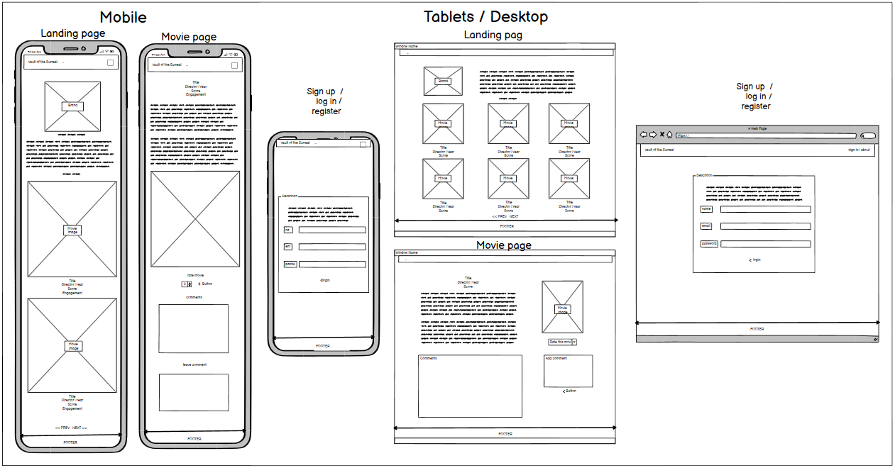
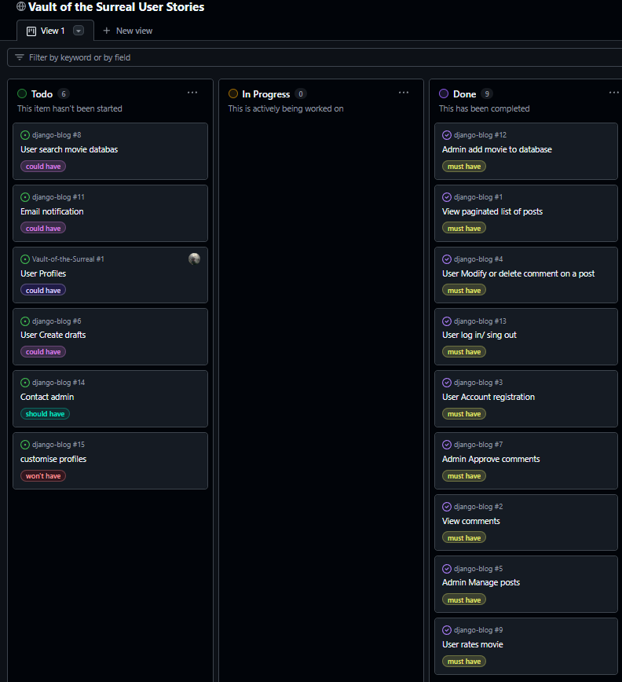

# Vault of the Surreal


The purpose of this 80s horror movie website, "Vault of the Surreal," is to create a comprehensive and engaging platform for enthusiasts of 1980s horror films. The website will serve as a community hub where users can log in, review, discus and rate their favorite 80s horror movies, while also discovering unseen films from the era. The site will feature a robust database managed by administrators, including detailed movie descriptions, images, and user-generated content.

## Table of Contents

## Target Audience

Horror Enthusiasts: Fans of the horror genre, particularly those with a nostalgic appreciation for 80s horror films.

Film Critics and Reviewers: Individuals who enjoy critiquing and discussing movies, sharing their insights and opinions on different films.

Collectors and Archivists: People interested in the preservation and collection of vintage horror movies, memorabilia, and related media.

Casual Viewers: Users who occasionally watch horror movies and are curious to explore classic films from the 80s.

Retro Pop Culture Fans: Individuals with a broader interest in 80s pop culture, including fashion, music, and cinema.

## UX
### Wireframes



### Features

### Branding


### Colors

To ensure visual consistency and maintaing a classic horror theme, the color palette for the website are derived colours expected in horror movies: 


* Red - Blood
* Yellow - Toxic 
* Green - Slime
* Black Shade - Night Time

### Navigation

Inspired by the 80's comedy horror 'House' (c) 1984 New World Pictures


## Planning with A.I for UX

Brainstorming with GitHub Copilot was instrumental in developing the foundations for this project. By leveraging Copilot's AI-driven suggestions, I was able to quickly generate ideas for key features, user stories, and database design. This collaborative approach ensured that I covered all essential aspects of the project, from user authentication to movie database management, while also considering future enhancements. Copilot's ability to provide context-aware recommendations significantly streamlined the planning process, allowing me to focus on creating a comprehensive and engaging platform for 80s horror movie enthusiasts.

## AI-Prompted Image Generation

Using AI prompting for image generation, I aimed to create a hero image that captured the essence of 80s-style horror comic books. After experimenting with several AI-generated suggestions, we found the perfect image that embodied the retro horror aesthetic we desired. However, to make the image more usable for the website, I needed to manipulate it further in Gimp image software. This involved adjusting colors, enhancing details, and ensuring it seamlessly integrated with our site's design, ultimately resulting in a visually striking hero image that sets the tone for "Vault of the Surreal."

## Problem Statement

How can "Vault of the Surreal" provide a secure, user-friendly, and engaging platform for 80s horror movie enthusiasts to log in, review, and rate films, while ensuring efficient database management for administrators and fostering a vibrant community?

## MVP Features

### User Authentication

* Secure user registration and login functionality.
* Password recovery options.

### Movie Database

* Admin interface for adding, editing, and deleting movies.
* Basic movie details: title, year, director, brief description, and poster image.

### User Reviews and Ratings

* Ability for users to comment/discus and rate movies.
* Display average ratings and recent comments on movie page.

### Community Interaction

* Comment sections for user discussions on movie pages.
* CRUD Interaction

### Responsive Design

* Mobile-friendly layout to ensure usability on various devices.

### Privacy and Security

* Data protection measures to safeguard user information.
* Compliance with privacy policies and terms of service.

## Agile Development Process

## User Stories

MoSCoW Prioritization

MoSCoW prioritization was used in this project to clearly define and manage the essential features and functionalities required for the "Vault of the Surreal" website. By categorizing tasks into Must-haves, Should-haves, Could-haves, and Won't-haves, the development team can focus on delivering the most critical aspects first, ensuring that the core objectives are met within the project timeline. This method helps in making informed decisions and efficiently allocating time to achieve a successful MVP launch.

With CoPilot I was able to identigy core reuqirement for our user stories.

* As a User, I want to register and log in so that I can access personalized features of the site.

* As a User, I want to browse and search for 80s horror movies so that I can discover films to watch and review.

* As a User, I want to rate and review movies so that I can share my opinions and see what others think.

* As a User, I want to view other users' reviews and ratings so that I can get insights into movies before watching them.

* As a User, I want to customize my profile so that I can share a bit about myself and my movie preferences.

* As an Admin, I want to add, edit, and delete movies in the database so that the movie collection is comprehensive and up-to-date.

* As an Admin, I want to manage user accounts so that the platform remains secure and well-maintained.

* As an Admin, I want to moderate reviews and comments so that the community remains respectful and engaging.

* As a User, I want to receive notifications for replies and interactions so that I stay engaged with the community.

* As a User, I want to filter movies by genre, rating, and year so that I can easily find movies that interest me.

* As a User, I want to be able to report posts if the do not align with the sites theme.

GitHub project board was utilised for managing the tasks for this project.
This approach allowed me to focus on the main features for the MVP, ensuring efficient time management and prioritization of tasks. By clearly defining the essential functionalities, I was able to manage and deliver a robust and user-friendly platform within the project timeline that fulfilled UX criteria.




## User Registration and Login

### User accounts

* User navigates to the registration page.

* User enters name, email optional, password, and other required details.

* User submits the form.

* System updates to say logged in (with new account).

* User  can now log in with their credentials.

* Data protection measures to safeguard user information.

* Compliance with privacy policies and terms of service.

## User interaction

* User navigates to a movie's detail page.

* User able to read movie details

* User able to add to a discussion board and edit later

### Rate and Review Movies

* User able to score a movie 1 - 10

* User notified of submitting a rating

* Use able to change the rating afterwards

## Admin Manage Movies

### Admin

* Admin logs in with admin credentials.

* Admin navigates to the movie management page.

* Admin clicks on "Add Movie" and enters movie details (title, year, description, image).

* Admin submits the form.

* System updates the movie database.

## Future Enhancements (Post-MVP)

* User Profiles:

* User profile pages showing submitted reviews and ratings.

* Profile customization options (e.g., profile picture, bio).

### Advanced Search and Filtering

* More advanced filtering options (e.g., by actor, release date, user ratings).

### Social Media Integration

* Allow users to share reviews and ratings on social media platforms.

### Analytics and Insights

* Admin dashboard with analytics on user engagement and movie ratings.

### Movie Database Management-1

* User Search and Filter

* Search bar to find movies by title, director, or keywords.

* Filtering options to narrow down movies by genre, year, rating, etc.

### User Profiles

* Basic user profile pages showing submitted reviews and ratings, details and image.

### Contact admin

* initiallty a questions or report form where the user can submit details for Admin to priorities or dismiss.

# Prioritized Features for MVP

### User Authentication

* Secure user registration and login functionality.

* CRUD funtionality for posts

### Movie Database Management

* Admin interface for adding, editing, and deleting movies.

* Basic movie details: title, year, director, brief description, and poster image.

### User Reviews and Ratings

* Ability for users to submit reviews and ratings for movies.

* Display of average ratings and recent reviews on movie pages.

### Responsive Design

* Mobile-friendly layout to ensure usability on various devices.

### Privacy and Security

* Data protection measures to safeguard user information.

* Compliance with privacy policies and terms of service.

## Database Design

Working with Copilot we formulated a datbase structue to enable functionality of our MVP.
Promptingh copilot to generate a Entity-Relationship Diagram sugeested which appears to be appropriate for this project.

### Users Table

| Attribute | Data Type   | Description      |
|-----------|-------------|------------------|
| UserID    | INT         | Primary Key      |
| username  | VARCHAR(255)! Unique, Not Null |
| Email     | VARCHAR(255)| Unique, Not Null |
| Password  | VARCHAR(255)| Not Null         |
| IsAdmin   | BOOLEAN     | Default FALSE    |

### Movies Table

| Attribute  | Data Type   | Description      |
|------------|-------------|------------------|
| MovieID    | INT         | Primary Key      |
| Title      | VARCHAR(255)| Not Null         |
| slug       ! Varchar     | Unique           |
| Year       | INT         |                  |
| Director   | VARCHAR(255)|                  |
| Description| TEXT        |                  |
| ImageURL   | VARCHAR(255)|                  |
| Status     | Integer     | Default FALSE    |

### Reviews Table

| Attribute  | Data Type   | Description      |
|------------|-------------|------------------|
| ReviewID   | INT         | Primary Key      |
| UserID     | INT         | Foreign Key      |
| MovieID    | INT         | Foreign Key      |
| Rating     | INT         |                  |
| ReviewText | TEXT        |                  |
| ReviewDate | TIMESTAMP   | Default CURRENT_TIMESTAMP |
| Approved   | DateTime    | Auto Now Add     |


### Ratings Table

| Attribute | Data Type   | Description      |
|-----------|-------------|------------------|
| RatingID  | INT         | Primary Key      |
| MovieID   | INT         | Foreign Key      |
| UserID    | INT         | Foreign Key      |
| Score     | INT         | Rating score     |

### User Flow Diagram

Movie:

Contains fields like MovieID (primary key), Title, slug, Year, Director, Description, ImageURL, and status.

User:

Contains fields like id (primary key), username, email, and password.

Comment:

Contains fields like id (primary key), movie_id (foreign key to MovieID), author_id (foreign key to User), body, approved, and created_on.

as a diagram
Here's a visual representation of the database design and relationships for the Movie, Comment, and User models:

### ERD

```plaintext
+----------------+              +---------------+              +----------------+
|     Movie      |              |     User      |              |    Comment     |
+----------------+              +---------------+              +----------------+
| MovieID (PK)   |              | id (PK)       |              | id (PK)        |
| Title          |              | username      | <---------   | movie_id (FK)  |
| slug           |              | email         |              | author_id (FK) |
| Year           |              | password      |              | body           |
| Director       |              +---------------+              | approved       |
| Description    |                                             | created_on     |
| ImageURL       |                                         --->| movie_id       |
| status         |                                         |   | author_id      |
+----------------+                                         |   +----------------+
   1                                                       | 
   |                                                       |
   |                                                       |
   v                                                       v
+----------------+                                    +---------------+
| Comment        |                                    | User          |
+----------------+                                    +---------------+
| id (PK)        |                                    | id (PK)       |
| movie_id (FK)  | <--------------------------------  | username      |
| author_id (FK) |                                    | email         |
| body           |                                    | password      |
| approved       |                                    +---------------+
| created_on     |
+----------------+
   1
   |
   |
   v
+----------------+
|    Rating      |
+----------------+
| RatingID (PK)  |
| movie_id (FK)  |
| user_id (FK)   |
| score          |
+----------------+
```

Explanation:

Rating:

* Contains fields (primary key), movie_id (foreign key to MovieID), user_id (foreign key to User), and score.

### Relationships

One-to-Many Relationship:

* One Movie can have multiple Ratings.
* One User can give multiple Ratings.

Many-to-One Relationship:

* Each Rating is associated with one Movie.
* Each Rating is associated with one User.


Movie:

* Contains fields - MovieID (primary key), Title, slug, Year, Director, Description, ImageURL, and status.

### User

* Contains fields - id (primary key), username, email, and password.

### Comment

* Contains fields - id (primary key), movie_id (foreign key to MovieID), author_id (foreign key to User), body, approved, and created_on.

### Relationships

One-to-Many Relationship:

* One Movie can have multiple Comments.

* Each Comment is associated with one Movie.

Many-to-One Relationship:

* Each Comment is associated with one User.

* One User can write multiple Comments.

#

## Debugging

1.


### Solution.
 I encountered a bug related to the URL pattern configuration. After exploring, I discovered the bug was caused by a slug link not being the last in the order of URL patterns. To fix this, I ensured that the slug pattern was placed at the end of the URL configuration list. This adjustment prevents conflicts with other URL patterns and ensures that the correct view is rendered when a slug is accessed.

2.


### Solution.

Stack overflow offered a working suggestion whichj i corrected within the runtime.txt file.


3,


### Solution

This error was caused by an undefined variable being accessed in the JavaScript code. To resolve this issue, I reviewed the code to ensure all variables were properly defined before being used.

### A.I. for Improving Code and Performance

Leveraging GitHub Copilot for improving code performance was a game-changer for this project. By utilizing Copilot's AI-driven suggestions, I was able to identify and implement performance optimizations across various parts of the codebase. This included refactoring inefficient code, optimizing database queries, and enhancing the overall responsiveness of the website. Copilot's ability to provide context-aware recommendations helped streamline the optimization process, ensuring that the website runs smoothly and efficiently, providing a better user experience for 80s horror movie enthusiasts.


### Solution

The low score in best practices was due to an insecure HTTP requests being made instead of HTTPS for Cloudinary access. To fix this, I updated all external resource URLs in the code to use HTTPS, ensuring secure communication and compliance with modern web standards. However, Lighthouse performance still indicated an issue. By using Copilot, I found that implementing a 'Content Security Policy' (CSP) could enforce HTTPS requests. Copilot's initial suggestion was:

### Examples of Using GitHub Copilot for this project:

1. **Debugging**:
   - Copilot assisted in identifying and fixing bugs by suggesting corrections and improvements to the existing code.

2. **Search Engine Optimization (SEO)**:
   - Copilot recommended adding meta tags, alt attributes for images, and improving the overall structure of the HTML to enhance SEO.

3. **Code Improvements**:
   - Copilot provided suggestions for cleaner, more maintainable code, including best practices for Django development.

4. **Debugging**:
   - Copilot assisted in identifying and fixing bugs by suggesting corrections and improvements to the existing code.

   5. **Code Creation**:
      - Copilot suggested appropriate labeling and docstrings to make our code easier to read and maintain.
      - Copilot assisted in generating the database model via recommended prompts, ensuring a well-structured and efficient database design.

Leveraging GitHub Copilot for improving code performance was a game-changer for this project. By utilizing Copilot's AI-driven suggestions, I was able to identify and implement performance optimizations across various parts of the codebase. This included refactoring inefficient code, optimizing database queries, and enhancing the overall responsiveness of the website. Copilot's ability to provide context-aware recommendations helped streamline the optimization process, ensuring that the website runs smoothly and efficiently, providing a better user experience for 80s horror movie enthusiasts.

```html
<meta http-equiv="Content-Security-Policy" content="default-src 'self' https:; img-src 'self' https:; script-src 'self' https:; style-src 'self' 'unsafe-inline' https:; upgrade-insecure-requests;">
```

Despite this, the issue persisted. After several prompts with knowing we were on the right path, Copilot suggested adding 'block-all-mixed-content' to the policy, which resolved the issue.

```html
 <meta http-equiv="Content-Security-Policy" content="default-src 'self' https:; img-src 'self' https:; script-src 'self' https:; style-src 'self' 'unsafe-inline' https:; upgrade-insecure-requests; block-all-mixed-content;">
```

## Code Validation
### Result

| Test Type     | Tool/Validator    | Result    | Pass/Fail |
|---------------|-------------------|-----------|-----------|
| HTML          | W3C Validator     |           |   Pass    |
| CSS           | W3C CSS Validator | No errors |   Pass    |
| Accessibility | WAVE Tool         | No errors |   Pass    |
| Python        | PEP8              | No errors |   Pass    |

### HTML


### Jigsaw


### Wave


### Lighthouse


###

### Pep8 standards

To ensure all Python code meets PEP8 standards, the CI Python Linter has been utilized.


## Unit Testing with GitHub Copilot

Leveraging GitHub Copilot for creating unit tests was instrumental in ensuring the reliability and accuracy of the "Vault of the Surreal" project. Copilot's AI-driven suggestions helped generate initial test cases for various functionalities, including user authentication, movie database operations, and user interactions.

### Enhancing Test Accuracy

To improve the accuracy and completeness of the tests generated by Copilot, several adjustments were made:

1. **Refining Test Logic**:
   - Covered edge cases, including invalid inputs and exception handling.
   - Added checks to ensure database operations (add, edit, delete) work correctly.

2. **Improving Coverage**:
   - Expanded tests to cover more scenarios and critical features.
   - Included tests for user permissions to ensure only authorized actions.

3. **Optimizing Performance**:
   - Streamlined test setup and teardown to reduce redundancy and speed up execution.
   - Used mock objects to simplify tests and improve reliability.

### Our unit testing at work.


By leveraging Copilot's suggestions and making necessary adjustments, we ensured that our unit tests were robust, accurate, and comprehensive, contributing to the overall quality and reliability of the "Vault of the Surreal" project.


## Browser Compatibility Testing

To ensure that "Vault of the Surreal" provides a consistent user experience across different browsers, we conducted compatibility testing on various platforms. Below are the results:

| Browser        |  Operating System | Result    | Pass/Fail |
|----------------|------------------|-----------|------------|
| Google Chrome  |   Windows 10     | No issues | Pass       |
| Mozilla Firefox|   Windows 10     | No issues | Pass       |
| Microsoft Edge |   Windows 10     | No issues | Pass       |
| Safari         |   Iphone 13      | No issues | Pass       |
| Safari         |   Ipad 6         | No issues | Pass       | 

### Summary

The application was tested on multiple browsers and operating systems to ensure compatibility and a seamless user experience. All tests passed successfully, indicating that the website functions correctly across different platforms.


## Creating the Repository

### Github

Repository initially created on GitHub, Here's how

1. Sign in to GitHub
First, go to GitHub and log in to your account. If you don't have an account, you'll need to sign up.

2. Create a New Repository
Once you're logged in, click the + icon in the top-right corner of the page, and select New repository.

You’ll be taken to the Create a new repository page.

3. Set Up the Repository
Repository name: Choose a name for your repository (Vault of the Surreal).

Description (optional): You can add a brief description of your project.

Public or Private: Select whether you want the repository to be public (visible to everyone) or private (only you and selected collaborators can see it). This project is set to public

Initialize this repository with a README: It's often a good idea to check this box. It will create a README.md file in your repository, which you can edit to describe your project.

## Deployment for project

### Gitpod

Now that we have our repository on GitHub we can..

2.Open the GitHub Repository
Navigate to your GitHub repository in your web browser and copy the link for your repository.


3.Launch Gitpod and select New Workspace


4.Here you can paste the url to the repositry and select your editor.


5.Now that the repo is open in our editor any addition to the code are submitted to the repo in the terminal with the commands

git add .
git commit -m "Initial commit" (details of update)

git push

## Tools and Technologies used

* VScode
* Balsamiq - Wireframe design
* Gimp - Image design and manipulation
* w3.org - HTML Validator
* w3.org - Jigsaw
* Microsost Dev Tools - Lighthouse
* WebAim - Web Accessability Evaluation Tool
* GitHub
* Django
* Heroku
* Cloudinary
* CI Python Linter

## Credits

* Code Institute - Codestar walkthrough project
* Code Institute - Student support (Amy, Roo, John & Spencer)
* Stack Overflow - Problem solving
* Antonio Melé - Django 5 By Example
* Copilot - Asssitance in design processes, clarification of information and debugging
* Slack Huddles - (Michael, Steve & Phoebe)
* [Django Documentation](https://docs.djangoproject.com/en/5.1/)
* [Python Documentation](https://docs.python.org/3/)