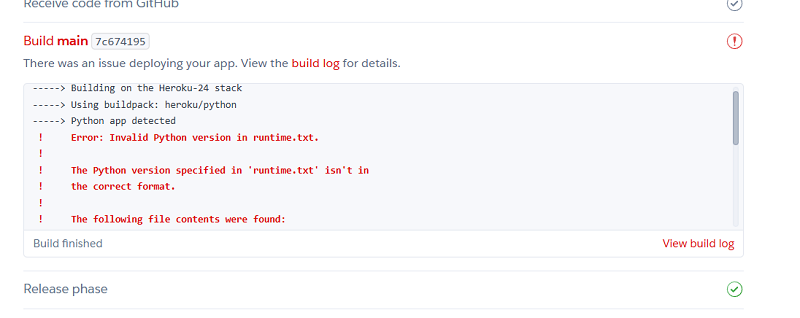

# Vault of the Surreal


The purpose of the 80s horror movie website, "Vault of the Surreal," is to create a comprehensive and engaging platform for enthusiasts of 1980s horror films. The website will serve as a community hub where users can log in, review, and rate their favorite 80s horror movies, while also discovering new films from the era. The site will feature a robust database managed by administrators, including detailed movie descriptions, images, and user-generated content.

## Table of Contents

1. [Target Audience](#target-audience)
2. [UX](#ux)
   * [Features](#features)
   * [Hero Image](#hero-image)
   * [Colors](#colors)
3. [Planning with A.I.](#planning-with-ai)
4. [AI-Prompted Image Generation](#ai-prompted-image-generation)
5. [Tools and Technologies used](#tools-and-technologies-used)
6. [Problem Statement](#problem-statement)
7. [MVP Features](#mvp-features)
8. [Agile Development Process](#agile-development-process)
   * [User Stories](#user-stories)
9. [User Registration and Login](#user-registration-and-login)
10. [Rate and Review Movies](#rate-and-review-movies)
11. [Admin Manage Movies](#admin-manage-movies)
12. [Database Design](#database-design)
13. [User Flow Diagram](#user-flow-diagram)
14. [Prioritized Features for MVP](#prioritized-features-for-mvp)
15. [Wireframes](#wireframes)
16. [Testing](#testing)
17. [Code Validation](#code-validation)
18. [Creating the Repository](#creating-the-repository)
19. [Deployment for Project](#deployment-for-project)
20. [Future Enhancements (Post-MVP)](#future-enhancements-post-mvp)
21. [Future Features](#future-features)
22. [Credits](#credits)

## Target Audience

Horror Enthusiasts: Fans of the horror genre, particularly those with a nostalgic appreciation for 80s horror films.

Film Critics and Reviewers: Individuals who enjoy critiquing and discussing movies, sharing their insights and opinions on different films.

Collectors and Archivists: People interested in the preservation and collection of vintage horror movies, memorabilia, and related media.

Casual Viewers: Users who occasionally watch horror movies and are curious to explore classic films from the 80s.

Retro Pop Culture Fans: Individuals with a broader interest in 80s pop culture, including fashion, music, and cinema.

## UX
### Wireframes


### Features

### Hero Image


### Branding


### Colors

To ensure visual consistency, the color palette for the website is derived from the hero image.


## Planning with A.I

Brainstorming with GitHub Copilot was instrumental in developing the foundations for this project. By leveraging Copilot's AI-driven suggestions, we were able to quickly generate ideas for key features, user stories, and database design. This collaborative approach ensured that we covered all essential aspects of the project, from user authentication to movie database management, while also considering future enhancements. Copilot's ability to provide context-aware recommendations significantly streamlined the planning process, allowing us to focus on creating a comprehensive and engaging platform for 80s horror movie enthusiasts.

## AI-Prompted Image Generation

Using AI prompting for image generation, we aimed to create a hero image that captured the essence of 80s-style horror comic books. After experimenting with several AI-generated suggestions, we found the perfect image that embodied the retro horror aesthetic we desired. However, to make the image more usable for our website, we needed to manipulate it further in Gimp image software. This involved adjusting colors, enhancing details, and ensuring it seamlessly integrated with our site's design, ultimately resulting in a visually striking hero image that sets the tone for "Vault of the Surreal."

## Tools and Technologies used

* Balsamiq - Wireframe design
* Gimp - Image design and manipulation

## Problem Statement

How can "Vault of the Surreal" provide a secure, user-friendly, and engaging platform for 80s horror movie enthusiasts to log in, review, and rate films, while ensuring efficient database management for administrators and fostering a vibrant community?

## MVP Features

### User Authentication

* Secure user registration and login functionality.
* Password recovery options.

### Movie Database

* Admin interface for adding, editing, and deleting movies.
* Basic movie details: title, year, director, brief description, and poster image.
* Categorization and tagging of movies (e.g., genre, sub-genre, year).

### User Reviews and Ratings

* Ability for users to submit reviews and ratings for movies.
* Display of average ratings and recent reviews on movie pages.

### Community Interaction

* Comment sections for user discussions on movie pages.
* CRUD Interaction

### Responsive Design

* Mobile-friendly layout to ensure usability on various devices.

### Privacy and Security

* Data protection measures to safeguard user information.
* Compliance with privacy policies and terms of service.

## Agile Development Process

## User Stories

MoSCoW Prioritization

MoSCoW prioritization was used in this project to clearly define and manage the essential features and functionalities required for the "Vault of the Surreal" website. By categorizing tasks into Must-haves, Should-haves, Could-haves, and Won't-haves, the development team can focus on delivering the most critical aspects first, ensuring that the core objectives are met within the project timeline. This method helps in making informed decisions, balancing stakeholder expectations, and efficiently allocating resources to achieve a successful MVP launch.


* As a User, I want to register and log in so that I can access personalized features of the site.

* As a User, I want to browse and search for 80s horror movies so that I can discover films to watch and review.

* As a User, I want to rate and review movies so that I can share my opinions and see what others think.

* As a User, I want to view other users' reviews and ratings so that I can get insights into movies before watching them.

* As a User, I want to customize my profile so that I can share a bit about myself and my movie preferences.

* As an Admin, I want to add, edit, and delete movies in the database so that the movie collection is comprehensive and up-to-date.

* As an Admin, I want to manage user accounts so that the platform remains secure and well-maintained.

* As an Admin, I want to moderate reviews and comments so that the community remains respectful and engaging.

* As a User, I want to receive notifications for replies and interactions so that I stay engaged with the community.

* As a User, I want to filter movies by genre, rating, and year so that I can easily find movies that interest me.

## User Registration and Login

### User

* User navigates to the registration page.

* User enters email, password, and other required details.

* User submits the form.

* System sends a verification email.

* User verifies the email.

* User logs in with verified credentials.

# Rate and Review Movies

text to go here

## User

* User navigates to a movie's detail page.

* User clicks on the "Write a Review" button.

* User enters a rating (e.g., 1-5 stars) and writes a review.

* User submits the review.

* System displays the review on the movie's page.

## Admin Manage Movies

### Admin

* Admin logs in with admin credentials.

* Admin navigates to the movie management page.

* Admin clicks on "Add Movie" and enters movie details (title, year, description, image).

* Admin submits the form.

* System updates the movie database.

## Database Design

Working with Copilot we formulated a datbase structue to enable functionality of our MVP.
Promptingh copilot to generate a Entity-Relationship Diagram sugeested which appears to be appropriate for this project.

### Users Table

| Attribute | Data Type   | Description      |
|-----------|-------------|------------------|
| UserID    | INT         | Primary Key      |
| username  | VARCHAR(255)! Unique, Not Null |
| Email     | VARCHAR(255)| Unique, Not Null |
| Password  | VARCHAR(255)| Not Null         |
| IsAdmin   | BOOLEAN     | Default FALSE    |

### Movies Table

| Attribute  | Data Type   | Description      |
|------------|-------------|------------------|
| MovieID    | INT         | Primary Key      |
| Title      | VARCHAR(255)| Not Null         |
| slug       ! Varchar     | Unique           |
| Year       | INT         |                  |
| Director   | VARCHAR(255)|                  |
| Description| TEXT        |                  |
| ImageURL   | VARCHAR(255)|                  |
| Status     | Integer     | Default FALSE    |

### Reviews Table

| Attribute  | Data Type   | Description      |
|------------|-------------|------------------|
| ReviewID   | INT         | Primary Key      |
| UserID     | INT         | Foreign Key      |
| MovieID    | INT         | Foreign Key      |
| Rating     | INT         |                  |
| ReviewText | TEXT        |                  |
| ReviewDate | TIMESTAMP   | Default CURRENT_TIMESTAMP |
| Approved   | DateTime    | Auto Now Add     |


### Ratings Table

| Attribute | Data Type   | Description      |
|-----------|-------------|------------------|
| RatingID  | INT         | Primary Key      |
| MovieID   | INT         | Foreign Key      |
| UserID    | INT         | Foreign Key      |
| Score     | INT         | Rating score     |

### User Flow Diagram

Movie:

Contains fields like MovieID (primary key), Title, slug, Year, Director, Description, ImageURL, and status.

User:

Contains fields like id (primary key), username, email, and password.

Comment:

Contains fields like id (primary key), movie_id (foreign key to MovieID), author_id (foreign key to User), body, approved, and created_on.

as a diagram
Here's a visual representation of the database design and relationships for the Movie, Comment, and User models:

### ERD

```plaintext
+----------------+              +---------------+              +----------------+
|     Movie      |              |     User      |              |    Comment     |
+----------------+              +---------------+              +----------------+
| MovieID (PK)   |              | id (PK)       |              | id (PK)        |
| Title          |              | username      | <---------   | movie_id (FK)  |
| slug           |              | email         |              | author_id (FK) |
| Year           |              | password      |              | body           |
| Director       |              +---------------+              | approved       |
| Description    |                                             | created_on     |
| ImageURL       |                                         --->| movie_id       |
| status         |                                         |   | author_id      |
+----------------+                                         |   +----------------+
   1                                                       | 
   |                                                       |
   |                                                       |
   v                                                       v
+----------------+                                    +---------------+
| Comment        |                                    | User          |
+----------------+                                    +---------------+
| id (PK)        |                                    | id (PK)       |
| movie_id (FK)  | <--------------------------------  | username      |
| author_id (FK) |                                    | email         |
| body           |                                    | password      |
| approved       |                                    +---------------+
| created_on     |
+----------------+
   1
   |
   |
   v
+----------------+
|    Rating      |
+----------------+
| RatingID (PK)  |
| movie_id (FK)  |
| user_id (FK)   |
| score          |
+----------------+
```

Explanation:

Rating:

* Contains fields (primary key), movie_id (foreign key to MovieID), user_id (foreign key to User), and score.

### Relationships

One-to-Many Relationship:

* One Movie can have multiple Ratings.
* One User can give multiple Ratings.

Many-to-One Relationship:

* Each Rating is associated with one Movie.
* Each Rating is associated with one User.


Movie:

* Contains fields like MovieID (primary key), Title, slug, Year, Director, Description, ImageURL, and status.

### User

* Contains fields like id (primary key), username, email, and password.

### Comment

* Contains fields like id (primary key), movie_id (foreign key to MovieID), author_id (foreign key to User), body, approved, and created_on.

### Relationships

One-to-Many Relationship:

* One Movie can have multiple Comments.

* Each Comment is associated with one Movie.

Many-to-One Relationship:

* Each Comment is associated with one User.

* One User can write multiple Comments.

## Prioritized Features for MVP

### User Authentication

* Secure user registration and login functionality.

* CRUD funtionality for posts

### Movie Database Management

* Admin interface for adding, editing, and deleting movies.

* Basic movie details: title, year, director, brief description, and poster image.

### User Reviews and Ratings

* Ability for users to submit reviews and ratings for movies.

* Display of average ratings and recent reviews on movie pages.

### Responsive Design

* Mobile-friendly layout to ensure usability on various devices.

### Privacy and Security

* Data protection measures to safeguard user information.

* Compliance with privacy policies and terms of service.

## Wireframes


## Debugging

1.


### Solution.
 I encountered a bug related to the URL pattern configuration. After exploring, I discovered the bug was caused by a slug link not being the last in the order of URL patterns. To fix this, I ensured that the slug pattern was placed at the end of the URL configuration list. This adjustment prevents conflicts with other URL patterns and ensures that the correct view is rendered when a slug is accessed.

2.


### Solution.

Stack overflow offered a working suggestion whichj i corrected within the runtime.txt file.


3,


### Solution

This error was caused by an undefined variable being accessed in the JavaScript code. To resolve this issue, I reviewed the code to ensure all variables were properly defined before being used.

## Testing

text to go here

## Code Validation

## Creating the Repository

### Github

Repository initially created on GitHub, Here's how

1. Sign in to GitHub
First, go to GitHub and log in to your account. If you don't have an account, you'll need to sign up.

2. Create a New Repository
Once you're logged in, click the + icon in the top-right corner of the page, and select New repository.

You’ll be taken to the Create a new repository page.

3. Set Up the Repository
Repository name: Choose a name for your repository (Vault of the Surreal).

Description (optional): You can add a brief description of your project.

Public or Private: Select whether you want the repository to be public (visible to everyone) or private (only you and selected collaborators can see it). This project is set to public

Initialize this repository with a README: It's often a good idea to check this box. It will create a README.md file in your repository, which you can edit to describe your project.

## Deployment for project

### Gitpod

Now that we have our repository on GitHub we can..

2.Open the GitHub Repository
Navigate to your GitHub repository in your web browser and copy the link for your repository.


3.Launch Gitpod and select New Workspace


4.Here you can paste the url to the repositry and select your editor.


5.Now that the repo is open in our editor any addition to the code are submitted to the repo in the terminal with the commands

git add .
git commit -m "Initial commit" (details of update)

git push

## Future Enhancements (Post-MVP)

* User Profiles:

* User profile pages showing submitted reviews and ratings.

* Profile customization options (e.g., profile picture, bio).

### Advanced Search and Filtering

* More advanced filtering options (e.g., by actor, release date, user ratings).

### Social Media Integration

* Allow users to share reviews and ratings on social media platforms.

### Analytics and Insights

* Admin dashboard with analytics on user engagement and movie ratings.

### Movie Database Management-1

 Categorization and tagging of movies (e.g., genre, sub-genre, year).

* Search and Filter:

* Search bar to find movies by title, director, or keywords.

* Filtering options to narrow down movies by genre, year, rating, etc.

## Future Features

text to go here

## User Profiles

* Basic user profile pages showing submitted reviews and ratings.

## Credits

* Code Institute - Codestar walkthrough project
